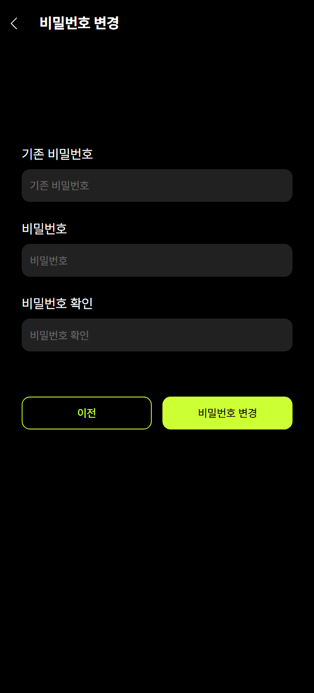

# OCHA 헬스

## 💡 UCC

## 🚩 목차

1. 기획 배경
2. 서비스 소개
3. 기능 소개
4. 기술 스택
5. 프로젝트 일정 및 기타 산출물
6. 팀원 소개 및 소감

## ✨ 기획 배경

### 개요

- 한 줄 설명 : 내가 원하는 시간에 원하는 운동을 하고 싶은 사람을 위한 헬스 관리 플랫폼
- 서비스명 : **0CHA 헬스**

### 목적

- 운동의 모든 것을 한 곳에서 **무료로**
- 내가 원하는 시간에 내가 원하는 운동을
- 자신만의 운동 **루틴**과 **기록**을 관리
- **캘린더**와 **피드**를 이용한 동기 부여
- **AI 티처**를 통한 자세 교정
- 운동용품을 사고팔기 위한 **장터**까지

### 현 상황

- 여가 시간 부족에서 기인한 10대 체육활동 시간 부족 [운동 안 하는 청년들 ··· 10대 체육 여든까지 간다](https://www.kunews.ac.kr/news/articleView.html?idxno=42452)
- 대한민국 청소년 운동 부족 심각... 전 세계 최하위권 [대한민국 청소년 신체활동 성적표](https://www.khan.co.kr/sports/sports-general/article/202312072343015)

## ✨ 서비스 소개

### 페르소나

- 건강관리를 위해 운동을 시작하고 싶은 박상천씨
  - 운동하고 싶은 부위에 대한 운동 정보를 확인할 수 있다.
  - 내가 하고 싶은 운동을 모아 나만의 루틴을 만들고 운동할 수 있다.
  - 오늘의 루틴을 완료한 후 피드에 공유하여 건강한 헬스 커뮤니티를 형성할 수 있다.
  - 자신의 운동 이력과 데이터를 확인할 수 있다.
  - AI 티처에게 자세 교정을 받을 수 있다.

### 기대효과

- 시간, 장소에 구애받지 않는 나만의 루틴 설정
- 한 눈에 관리할 수 있는 내 운동 이력
- 운동 피드 공유를 통해 실시간 소통 및 꾸준히 운동하는 것에 대한 동기 부여
- 운동 관련 기능을 통합함으로써 사용자 편의성 증대

## ✨ 기능 소개

- **메인 페이지 기능**
  - **0CHA가 추천하는 루틴** : 0CHA가 직접 개발하고 고안한 루틴을 추천합니다.
  - **진행 중인 운동** : 현재 진행 중인 운동이 있는 경우 바로 이동할 수 있습니다.
  - **내 루틴** : 내 루틴을 최신 순으로 보여집니다. 더 보기를 누르면 루틴 목록으로 각 루틴의 상세 정보를 누르면 루틴의 상세 정보를 확인할 수 있습니다.
- **회원가입 & 프로필 페이지 기능**
  - **회원가입** : 이메일 인증, 비밀번호, 생년월일, 전화번호, 닉네임 입력 후 가입할 수 있습니다.
  - **로그인 & 로그아웃** : JWT Token을 사용하여 로그인 및 로그아웃이 가능합니다.
  - **소셜 로그인** : Google, Kakao 계정과 연동하여 로그인이 가능합니다.
  - **프로필 수정** : 프로필 이미지와 닉네임을 변경할 수 있습니다.
  - **내 정보 수정** : 내 키와 몸무게 활동 지역을 변경할 수 있습니다.
  - **회원 탈퇴** : 회원 탈퇴 문구 작성 후 탈퇴 가능합니다.
- **운동 페이지 기능**
  - **운동 목록** : 상단의 부위를 탭하여 해당 부위의 운동 목록을 확인할 수 있습니다.
  - **운동 찜** : 사용자는 별표 버튼을 클릭해 운동을 찜/찜해제 할 수 있습니다.
  - **운동 상세보기** : 운동을 클릭해 각 운동의 운동 예시와 운동 상세정보를 확인할 수 있습니다.
  - **루틴에 운동 추가** : 사용자는 V표를 클릭해 루틴에 추가할 운동을 선택할 수 있고 새 루틴에 추가하기 버튼을 클릭해 새 루틴에 운동을 추가할 수 있습니다.
  - **운동 검색** : 검색창에 검색어를 입력하면 해당 부위에 맞는 운동이 실시간으로 검색됩니다.
- **기록 페이지 기능**

  - **달력** : 루틴이 저장된 날은 녹색, 선택된 날은 빨간색, 오늘은 녹색 원이 표시됩니다. 루틴이 없는 날을 선택할 경우 루틴 생성하기 버튼이, 있는 날을 선택할 경우 루틴 확인하기 버튼이 토글됩니다.
  - **인바디 등록** : 사진 혹은 촬영을 통해 인바디 결과지를 등록할 수 있습니다. 등록한 결과지를 토대로 인식하고, 세부정보를 입력할 수 있는 폼을 제공합니다.
  - **인바디 결과** : 본인의 인바디 입력을 항목별로 추이를 확인할 수 있는 그래프를 제공합니다.
  - **운동 기록** : 운동 기록 탭에서 개인 운동량 추이와 총 운동 시간 추이를 확인할 수 있습니다.

- **AI 페이지 기능**
  - **운동 설정** : 운동 설정에서 수행할 운동과 횟수(1~10)를 선택할 수 있습니다. 시작하기 버튼을 누르면 초기 세팅이 완료됩니다.
  - **운동 시작** : 준비 버튼과 이어 카메라 시작 버튼을 누르면 준비 시간 5초 후 운동을 시작합니다.
  - **운동 수행** : 잘못된 자세를 취하는 경우 화면에 X 표시가 정 자세를 취하는 경우 화면에 O 표시가 나타납니다. 운동할 때마다 횟수를 카운트해줍니다. 아래 진행 바를 통해서도 시각적으로 확인할 수 있습니다. 지정 횟수에 도달하면 자동으로 종료됩니다. 운동을 중간에 종료시키고 싶은 경우 운동 종료 버튼을 눌러 운동을 종료할 수 있습니다.
  - **운동 결과** : 운동 종료시 자동으로 운동 결과 모달이 나타납니다. 사용자는 본인이 수행한 자세가 올바른지 아닌지 코멘트를 확인할 수 있습니다.
- **피드 페이지 기능**

  - **피드 보기** : 자신이 팔로우한 유저들의 피드를 최신순으로 확인할 수 있습니다.
  - **피드 작성** : 오늘 운동을 한 경우 피드를 작성할 수 있습니다. 이미지는 반드시 첨부해야 합니다. 내용은 없어도 됩니다.
  - **피드 수정 & 삭제** : 본인이 작성한 피드의 내용과 이미지를 수정 및 삭제할 수 있습니다.
  - **댓글 작성 & 수정 & 삭제** : 사용자들은 피드에 댓글을 작성하고 수정, 삭제할 수 있습니다.
  - **피드 좋아요** : 사용자는 한 피드에 대해 하나의 좋아요/좋아요 취소가 가능합니다.
  - **무한 스크롤** : 피드 목록 하단에 도달할 경우 추가 피드를 탐색해 줍니다.
  - **유저 검색** : 검색창에서 유저 닉네임을 통해 유저를 검색할 수 있습니다.

- **거래 페이지 기능**

  - **상품 보기** : 전체 상품들을 확인할 수 있습니다. 상품은 대표 이미지, 제목, 가격, 판매 상태, 좋아요 개수가 나타납니다.
  - **상품 필터링** : 광역자치단체, 기초자치단체, 검색어를 이용해 해당 조건을 충족하는 상품들을 필터링해 보여줍니다.
  - **상품 좋아요** : 사용자는 하트 버튼을 눌러 좋아요/좋아요 취소가 가능합니다.
  - **상품 상세 모달** : 상세 모달에서는 판매자, 내용이 추가로 표시됩니다.
  - **상품 게시글 작성** : 판매자는 최대 5장 한 장당 5MB 이하의 사진들을 게시할 수 있습니다. 게시 조건은 이미지 한 장 이상, 제목, 가격, 내용 모두 필요합니다.
  - **상품 수정&삭제** : 판매자(글 게시자)는 상품의 수정, 삭제, 판매 상태 변경이 가능합니다. 판매 완료 상태인 경우 수정은 불가합니다.
  - **채팅하기** : 채팅하기를 통해 판매자 또는 구매자와 채팅할 수 있습니다. 판매자가 누른 경우 채팅 목록으로, 구매자가 누른 경우 판매자와의 채팅으로 이동합니다.
  - **페이지네이션** : 사용자는 10개 이상의 게시물이 있는 경우 페이지로 분할된 상품 목록을 확인할 수 있습니다.

- **SNS 프로필 페이지 기능**

  - **SNS 프로필 상단** : SNS 프로필 상단에서는 닉네임 운동, 거래 게시글 수, 팔로잉, 팔로워 수가 나타납니다. 자신의 프로필인 경우 채팅 목록과 내 정보 버튼이, 다른 사람의 프로필인 경우 채팅하기와 프로필 버튼이 나타납니다.
  - **운동/거래 탭** : 해당 유저가 게시한 운동, 거래 게시글의 대표 이미지가 3\*n 형태의 격자로 나타납니다. 운동 게시글을 클릭할 경우 위 아래로 스크롤할 경우 이전 다음 게시글을 확인할 수 있습니다. 거래 게시글을 클릭할 경우 해당 거래 게시글의 상세 모달이 띄워집니다.

- **채팅 기능**
  - **채팅목록** : 채팅 목록에서는 사용자가 하나 이상의 채팅 이력이 있는 채팅방을 확인할 수 있습니다.
  - **채팅** : 채팅에서는 사용자가 상대방과 채팅 기능을 할 수 있습니다. 채팅방 입장 시 로딩이 걸릴 수 있습니다.

## ✨ 기술 스택

- **프론트엔드** : React, TypeScript, Redux-toolkit, styled-components, Stomp, PWA
- **백엔드** : Spring Boot, Spring Security, JWT, Oauth 2.0, FCM
- **인프라** : Docker, Nginx, Jenkins, Redis, MySQL, Certbot, EC2
- **특화 기술** : Teachable Machine, Clova OCR
- **이슈 관리** : JIRA, Mattermost, Notion

### 아키텍처 설계도

## ✨ 프로젝트 일정 및 기타 산출물

### 프로젝트 일정

**전체 일정** : 2024.07.08 ~ 2024.08.16(총 40일)

- **기획** : 2024.07.08 ~ 2024.07.21(총 14일)
- **개발** : 2024.07.22 ~ 2024.08.16(총 26일)

### Git Flow

### 유저플로우

### 피그마 화면 정의서

### ERD

### API 명세서

| [API 명세서](https://past-currant-4d8.notion.site/API-57f2a24c811143dea87f1da52203df55) |                                   |
| :-------------------------------------------------------------------------------------: | :-------------------------------: |
|                                                         |   |
|                                                         |   |
|                                                         |   |
|                                                         |   |
|                                                         |  |
|                                                        |  |

## ✨ 화면

|                                                          |                                                          |                                                          |                                                           |
| :------------------------------------------------------: | :------------------------------------------------------: | :------------------------------------------------------: | :-------------------------------------------------------: |
|                      |                   |          |              |
|                          로그인                          |                         회원가입                         |                    회원 추가정보 입력                    |                        이메일 찾기                        |
|  |              |            |                    |
|                     이메일 찾기 결과                     |                      비밀번호 찾기                       |                      비밀번호 변경                       |                        메인 페이지                        |
|           |  |       |      |
|                       프로필 메인                        |                       내 정보 수정                       |                    프로필 이미지 수정                    |                       비밀번호 수정                       |
|            |          |             |            |
|                        운동 목록                         |                        운동 상세                         |                        루틴 목록                         |                         루틴 상세                         |
|           |               |          |               |
|                      루틴 생성하기                       |                         운동하기                         |                        운동 완료                         |                     기록 메인(캘린더)                     |
|           |            |          |           |
|                       인바디 등록                        |                       인바디 스캔                        |                       인바디 결과                        |                         운동 기록                         |
|              |                    |                   |                   |
|                  AI 트레이너 초기 설정                   |                        운동 대기                         |                         운동 중                          |                     AI 트레이닝 결과                      |
|             |                  |       |        |
|                        SNS 프로필                        |                         SNS 피드                         |                    SNS 피드 작성/수정                    |                       SNS 피드 댓글                       |
|                |     |  |  |
|                         SNS 장터                         |                      SNS 장터 검색                       |                     SNS 장터 글 작성                     |                    SNS 장터 상세 보기                     |
|          |                  |                                                          |                                                           |
|                       SNS 채팅목록                       |                         SNS 채팅                         |                                                          |                                                           |
